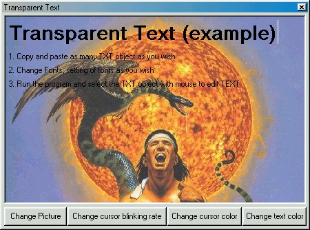

## Transparent Text

### Description

The problem with standard TextBox is that it background isn't and can't be transparent, I've developed the transparent text with standard Label objects.

You can't type in text in Label object at Runtime, but with help of PictureBox you can type characters and edit text in Label objects. All Label objects which you want to be transparent and editable you must put on one PictureBox, and PictureBox will then work with Label objects…

You can use the transparent text with "Microsoft Forms 2.0 Object Library" - "FM20.DLL", but there is one problem: this ActiveX component is not recommended to use, and it'll work only on computers with Microsoft Office 98 or late installed.
 
### More Info
 

             |
---                |---
**Submitted On**   |2001-11-28 20:26:42
**By**             |[Zvonimir Molan](https://github.com/Planet-Source-Code/PSCIndex/blob/master/ByAuthor/zvonimir-molan.md)
**Level**          |Intermediate
**User Rating**    |4.8 (24 globes from 5 users)
**Compatibility**  |VB 6\.0
**Category**       |[Custom Controls/ Forms/  Menus](https://github.com/Planet-Source-Code/PSCIndex/blob/master/ByCategory/custom-controls-forms-menus__1-4.md)
**World**          |[Visual Basic](https://github.com/Planet-Source-Code/PSCIndex/blob/master/ByWorld/visual-basic.md)
**Archive File**   |[Transparen3814111282001\.zip](https://github.com/Planet-Source-Code/zvonimir-molan-transparent-text__1-29290/archive/master.zip)

